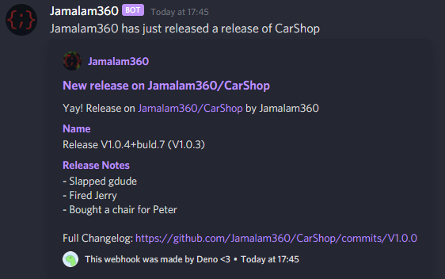

Allows you to send custom Discord messages when a new release is published on
GitHub. The content of the messages can be much more complex than the default
embeds.

For example, this is the message sent using the default configuration:



## Using

First, follow the guide below to configure the program. Then make sure it is
running on your machine (I use my VPS so that it is always online). Make sure
that the port you chose can be accessed by the GitHub webhook, if applicable.

Next go to the GitHub repository or organization of choice and create a webhook
pointing to `http://your.ip.address.here:port/` (where `your.ip.address.here` is
the IP address of your machine and `port` is the port you chose (default 8080)).
Make sure the webhook is 'subscribed' to the `release` event.

Then make your discord webhook and add it to the config file. Multiple webhooks can be added.

Then make sure the code is running using
`deno run --allow-net --allow-read index.ts`. The program should now be working!
You can find instructions on installing Deno [here](https://deno.land).

## Configuration

This section is very text heavy, I recommend you look at `config.json.example`,
or you can just use that example without modifying it (apart from adding the
Discord webhook URL):

```
mv config.json.example config.json
```

You must create a file named `config.json` in the same path as you are running
the file. The structure is like so:

- `discord_webhook_urls`
  - Description: The URLs of the Discord webhooks to send the message to
  - Type: `string[]`
  - Required: `Yes`
  - Default: `N/A`
- `port`
  - Description: The port to listen on
  - Type: `integer`
  - Required: `No`
  - Default: `8080`
- `message`
  - Description: The message to send to the Discord webhook
  - Type: `WebhookMessage` (see below)
  - Required: `Yes`
  - Default: `N/A`

### `WebhookMessage`

**Note:** At least one of `content` and `embeds` is required.

- `content`
  - Description: The content of the message
  - Type: `string`
  - Required: `No`
  - Default: `Empty String`
- `username`
  - Description: The username to use for the message
  - Type: `string`
  - Required: `No`
  - Default: `Empty String` (Discord defaults to name you set when creating the
    webhook)
- `avatar_url`
  - Description: The URL of the avatar to use for the message
  - Type: `string`
  - Required: `No`
  - Default: `Empty String` (Discord defaults to the avatar you set when
    creating the webhook)
- `embeds`
  - Description: The embeds to send with the message
  - Type: `Embed[]` (see below)
  - Required: `No`
  - Default: `Empty Array`

### `Embed`

- `title`
  - Description: The title of the embed
  - Type: `string`
  - Required: `No`
  - Default: `Empty String`
- `description`
  - Description: The description of the embed
  - Type: `string`
  - Required: `No`
  - Default: `Empty String`
- `url`
  - Description: The URL to send with the embed
  - Type: `string`
  - Required: `No`
  - Default: `Empty String`
- `timestamp`
  - Description: ISO8601 timestamp for the timestamp of the embed
  - Type: `string`
  - Required: `No`
  - Default: `new Date().toISOString()`
- `color`
  - Description: The color of the embed
  - Type: `integer`
  - Required: `No`
  - Default: `None` (Discord defaults to no color)
- `footer`
  - Description: The footer of the embed
  - Type: `Footer` (see below)
  - Required: `No`
  - Default: `Empty Object`
- `author`
  - Description: The author of the embed
  - Type: `Author` (see below)
  - Required: `No`
  - Default: `Empty Object`
- `fields`
  - Description: The fields of the embed
  - Type: `Field[]` (see below)
  - Required: `No`
  - Default: `Empty Array`

### `Footer`

- `text`
  - Description: The text of the footer
  - Type: `string`
  - Required: `Yes`
  - Default: `N/A`
- `icon_url`
  - Description: The URL of the icon of the footer
  - Type: `string`
  - Required: `No`
  - Default: `Empty String`

### `Author`

- `name`
  - Description: The name of the author
  - Type: `string`
  - Required: `Yes`
  - Default: `N/A`
- `url`
  - Description: The URL of the author
  - Type: `string`
  - Required: `No`
  - Default: `Empty String`
- `icon_url`
  - Description: The URL of the icon of the author
  - Type: `string`
  - Required: `No`
  - Default: `Empty String`

### `Field`

- `name`
  - Description: The name of the field
  - Type: `string`
  - Required: `Yes`
  - Default: `N/A`
- `value`
  - Description: The value of the field
  - Type: `string`
  - Required: `Yes`
  - Default: `N/A`
- `inline`
  - Description: Whether the field is inline or not
  - Type: `boolean`
  - Required: `No`
  - Default: `None` (uses Discord default, request is sent without it)

## Variables

Within your `WebhookMessage` object, you can add variables to be replaced with
content from the GitHub release.

They can be used in the following way, for example:

`$variable`

`"content": "$author_name release a new version!"`

The following variables are available:

- `release_url`
  - Description: The URL of the release, leads to the GitHub website
- `release_tag_name`
  - Description: The git tag name of the release
- `release_name`
  - Description: The name of the release
- `release_body`
  - Description: The body of the release
- `author_name`
  - Description: The username of the author of the release
- `author_profile_url`
  - Description: The URL to the profile of the author of the release
- `author_avatar_url`
  - Description: The URL to the avatar of the author of the release
- `repo_name`
  - Description: The name of the repository (e.g. `CarShop`)
- `repo_full_name`
  - Description: The full name of the repository (e.g. `Jamalam360/CarShop`)
- `repo_url`
  - Description: The URL of the repository, leads to the GitHub website
